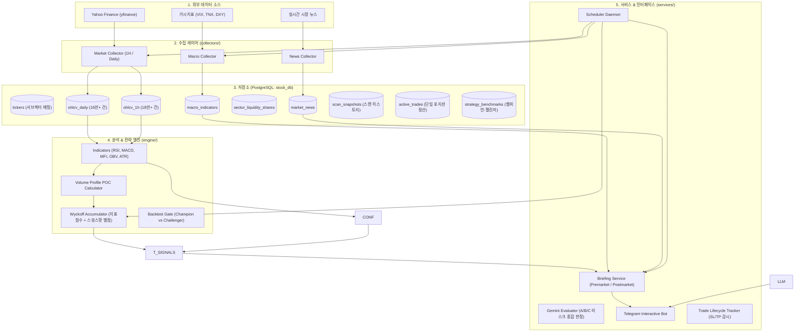

# Whykoff System Architecture & Database Design

이 문서는 `Whykoff` 시스템의 전체 파이프라인 구조와 리팩토링된 데이터베이스 스키마 명세서입니다.

---

## 1. 전체 아키텍처 다이어그램



---

## 2. 리팩토링된 PostgreSQL 데이터베이스 스키마

단순하고 쿼리 효율을 극대화한 DDL 설계입니다.

```sql
-- 1. 추적 종목 관리 테이블
CREATE TABLE IF NOT EXISTS tickers (
    ticker VARCHAR(20) PRIMARY KEY,
    query_ticker VARCHAR(20),
    name VARCHAR(100),
    sector_etf VARCHAR(10),
    is_active BOOLEAN DEFAULT TRUE,
    created_at TIMESTAMP WITH TIME ZONE DEFAULT NOW()
);

-- 2. 일봉 데이터 (ohlcv_daily)
CREATE TABLE IF NOT EXISTS ohlcv_daily (
    ticker VARCHAR(20) NOT NULL,
    datetime TIMESTAMP WITHOUT TIME ZONE NOT NULL,
    open NUMERIC(14, 4) NOT NULL,
    high NUMERIC(14, 4) NOT NULL,
    low NUMERIC(14, 4) NOT NULL,
    close NUMERIC(14, 4) NOT NULL,
    volume BIGINT NOT NULL,
    PRIMARY KEY (ticker, datetime)
);
CREATE INDEX IF NOT EXISTS idx_ohlcv_daily_ticker_dt ON ohlcv_daily (ticker, datetime DESC);

-- 3. 1시간봉 데이터 (ohlcv_1h)
CREATE TABLE IF NOT EXISTS ohlcv_1h (
    ticker VARCHAR(20) NOT NULL,
    datetime TIMESTAMP WITHOUT TIME ZONE NOT NULL,
    open NUMERIC(14, 4) NOT NULL,
    high NUMERIC(14, 4) NOT NULL,
    low NUMERIC(14, 4) NOT NULL,
    close NUMERIC(14, 4) NOT NULL,
    volume BIGINT NOT NULL,
    PRIMARY KEY (ticker, datetime)
);
CREATE INDEX IF NOT EXISTS idx_ohlcv_1h_ticker_dt ON ohlcv_1h (ticker, datetime DESC);

-- 4. 거시 환경 지표 (macro_indicators)
CREATE TABLE IF NOT EXISTS macro_indicators (
    symbol VARCHAR(20) NOT NULL,
    trade_date DATE NOT NULL,
    close NUMERIC(14, 4) NOT NULL,
    change_pct NUMERIC(8, 4),
    updated_at TIMESTAMP WITH TIME ZONE DEFAULT NOW(),
    PRIMARY KEY (symbol, trade_date)
);

-- 5. 섹터 유동성 점유율 (sector_liquidity_shares)
CREATE TABLE IF NOT EXISTS sector_liquidity_shares (
    symbol VARCHAR(10) NOT NULL,
    sector_name VARCHAR(50),
    trade_date DATE NOT NULL,
    share_pct NUMERIC(8, 4),
    share_delta NUMERIC(8, 4),
    change_pct NUMERIC(8, 4),
    PRIMARY KEY (symbol, trade_date)
);

-- 6. 종목 뉴스 (market_news)
CREATE TABLE IF NOT EXISTS market_news (
    id SERIAL PRIMARY KEY,
    symbol VARCHAR(20) NOT NULL,
    title TEXT NOT NULL,
    summary TEXT,
    published_at TIMESTAMP WITHOUT TIME ZONE NOT NULL,
    url TEXT,
    CONSTRAINT uq_news_item UNIQUE (symbol, published_at, title)
);
CREATE INDEX IF NOT EXISTS idx_news_symbol_pub ON market_news (symbol, published_at DESC);

-- 7. 스캔 시그널 이력 (scan_signals)
CREATE TABLE IF NOT EXISTS scan_signals (
    id SERIAL PRIMARY KEY,
    ticker VARCHAR(20) NOT NULL,
    strategy_type VARCHAR(50) NOT NULL,  -- 'WYCKOFF_BAGGER', 'CONFLUENCE_GOLDEN' 등
    score NUMERIC(5, 2) NOT NULL,
    current_price NUMERIC(14, 4) NOT NULL,
    stop_loss NUMERIC(14, 4),
    tp1 NUMERIC(14, 4),
    tp2 NUMERIC(14, 4),
    reasons JSONB,
    created_at TIMESTAMP WITH TIME ZONE DEFAULT NOW()
);
CREATE INDEX IF NOT EXISTS idx_signals_created ON scan_signals (created_at DESC);
```

---

## 3. 핵심 모듈 간 상호작용 규칙

1. **`core/`**: 다른 모듈에 의존하지 않는 최하위 기반 계층.
2. **`collectors/`**: `core/`에만 의존하며 데이터를 수집하여 DB에 저장.
3. **`engine/`**: `core/models.py`에만 의존하며, 데이터프레임을 받아 계산된 시그널 객체를 리턴 (DB 의존성 없음).
4. **`services/`**: `core/`, `collectors/`, `engine/`을 조합하여 최종 비즈니스 워크플로우(브리핑, 봇 알림)를 완성.
