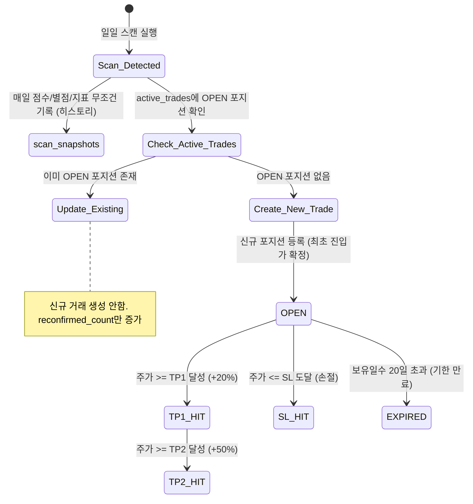

# Whykoff Core Logic & Strategy Specifications

이 문서는 `Whykoff` 시스템의 **정량 알고리즘, 지표 계산 수식, 백테스트 게이트 및 포지션 라이프사이클 관리 명세서**입니다.

---

## 1. Top-Down 2단계 아키텍처 원칙

본 시스템은 **"섹터 가산점을 개별 종목 점수에 더하지 않는다"**는 원칙을 적용합니다. 개별 종목의 차트 완성도와 거시 자금 흐름을 철저히 분리하여 노이즈를 차단합니다.

```text
[1단계: 거시 & 서브섹터 자금 흐름 진단]
  • 매크로 지표 (VIX, 10Y 국채금리, 달러인덱스)
  • 세부 서브섹터 ETF (반도체 SOXX, 소프트웨어 IGV, 보안 CIBR, 바이오 XBI, 원자력 URA, 크립토 BTC/WGMI 등) 자금 점유율 추적
       ↓ (자금 유입 서브섹터 도출 또는 사용자가 스캔 타겟 서브섹터 지정)
[2단계: 해당 서브섹터 유니버스 타겟 스캔]
  • 섹터 가산점 없이 순수한 차트와 수급으로만 와이코프 매집도 산출 (75.0점 이상)
       ↓
[3단계: 지표점수 vs 스윗스팟 별점(⭐) 2원화 평가]
  • 지표 원점수 (0~100점): 모멘텀 절대 강도
  • 스윗스팟 별점 (1~5성): 바닥 매집 완료도 (과열권 감점 / 스윗스팟 68~78점 최고점)
       ↓
[4단계: AI 종합 리스크 평가 (LLM Synthesizer)]
  • 스캔 결과 + 소속 서브섹터 동향 + 매크로 + 뉴스 크로스체크 ➔ 최종 A/B/C 등급 산출
```

---

## 2. 와이코프 바닥 매집 완료 스캐너 (Bagger Accumulation Setup)

### 2.1 전략 개요
- **목적**: 장기 하락 추세가 마무리되고 스마트머니(기관/고래)의 바닥 횡보 매집이 완성된 후 1차 상승 돌파(Markup) 초입에 진입하는 스윙 전략.
- **기준 타임프레임**: 일봉 (최소 120~250일치 캔들 필요)

### 2.2 단계별 정량 판별 알고리즘

```text
[검증 파이프라인]
1. 장기 하락 확인 (Drop >= 25%)
       ↓ PASS
2. 30일 박스권 수렴 확인 (진폭 <= 20%)
       ↓ PASS
3. 일봉 20일선 평탄화 확인 (-2.0% <= Slope <= +2.5%)
       ↓ PASS
4. 120일 볼륨 프로파일(POC) 지지판 안착 (0% ~ +7%)
       ↓ PASS
5. 스마트머니 수급 지표 우상향 (MFI, OBV, RSI)
       ↓ PASS
6. 진입 트리거 확인 (5/20선 돌파 & MACD 양전)
       ↓
[기술점수 산출] ➔ 스윗스팟 별점(⭐) 매핑 ➔ 타점 및 SL/TP 산출
```

#### [조건 1] 장기 하락 및 기간 조정 (Base Building)
- 최근 120영업일 내 최고가 대비 현재가 낙폭 계산:
  $$\text{Drop Rate} = \frac{\text{Current Price} - \text{High}_{120d}}{\text{High}_{120d}} \times 100$$
- **필터**: $\text{Drop Rate} \le -25.0\%$ (충분히 하락하지 않은 종목 즉시 배제)

#### [조건 2] 30일 박스권 에너지 수렴
- 최근 30영업일의 고점과 저점 진폭 계산:
  $$\text{Box Range} = \frac{\text{High}_{30d} - \text{Low}_{30d}}{\text{Low}_{30d}} \times 100$$
- **가산점**: $\text{Box Range} \le 20.0\%$ 만족 시 **+20점**
- **필터**: $20.0\%$ 초과 시 즉시 탈락 (아직 변동성 미수렴 상태)

#### [조건 3] 일봉 20일 이동평균선 평탄화 (Flat Check)
- 10일 전 대비 일봉 20선 기울기 계산:
  $$\text{Slope}_{\text{MA20}} = \frac{\text{MA20}_{\text{today}} - \text{MA20}_{10d\text{ ago}}}{\text{MA20}_{10d\text{ ago}}} \times 100$$
- **가산점**: $-2.0\% \le \text{Slope}_{\text{MA20}} \le +2.5\%$ 만족 시 **+15점**
- **필터**: $\text{Slope}_{\text{MA20}} < -2.0\%$ 시 탈락 (떨어지는 칼날 차단)

#### [조건 4] 볼륨 프로파일 최대 매물대 (POC) 지지 안착
- **POC 산출**: 최근 120일간의 가격 범위를 40개 구간(Bin)으로 분할하고 구간별 누적 거래량을 집계하여 최대 거래량 중심 가격 산출.
- **지지 판정**:
  - $\text{Current Price} \ge \text{POC} \times 0.985$
  - $\frac{\text{Current Price} - \text{POC}}{\text{POC}} \le 0.07$ (+7% 이내)
- **가산점**: POC 위 지지 안착 시 **+25점** (POC 밑에 갇힌 종목은 즉시 탈락)

#### [조건 5] 스마트머니 수급 지표 (MFI, OBV, RSI)
1. **MFI (자금 흐름 지수)**: $\text{MFI} \ge 45.0$ 및 15일 전 대비 상승 시: **+15점**
2. **OBV (누적 거래량)**: $\text{OBV} > \text{OBV 10일 이동평균}$ (골든크로스): **+15점**
3. **RSI (상대강도지수)**: $42.0 \le \text{RSI} \le 62.0$ (과매도 탈출 후 건전한 턴): **+10점**

#### [조건 6] 진입 트리거 (Trigger)
1. $\text{Current Price} \ge \text{MA5}$ 및 $\text{Current Price} \ge \text{MA20}$: **+10점**
2. $\text{MACD Histogram} > 0$ 또는 직전 봉 대비 상승: **+5점**

---

## 3. 지표 원점수 vs 스윗스팟 별점(⭐) 2원화 평가 체계

단순히 지표 점수가 90점 이상으로 높다고 무조건 좋은 것이 아닙니다. 이미 시세가 분출된 과열 종목을 피하고 **바닥 매집 완성 초입(Sweet Spot)**을 발굴하기 위해 별점 제도를 운영합니다.

### 3.1 스윗스팟 점수(68~78점)의 수학적·와이코프 구조적 근거
1. **기초 3대 매집 골격 점수의 합 = 60점**:
   - `박스권 수렴(+20) + 20선 평탄화(+15) + POC 지지판 안착(+25) = 60점`
2. **스마트머니 수급 초입 결합 (68점 ~ 78점)**:
   - 기본 60점에 `MFI 자금 유입(+15)` 또는 `OBV 골든크로스(+15)` 또는 `RSI 턴(+10)` 중 1~2개 지표가 막 돌아서기 시작하는 단계.
   - **와이코프 Phase C/D (LPS - Last Point of Support)**: 스마트머니의 조용한 매집은 완성되었으나 아직 대중 거래량이 터지지 않아 폭등 직전인 상태.
   - **손익비 극대화**: 주가가 매집 박스권 바닥 부근에 위치하여 손절선(박스 하단)과의 거리가 2~3%로 매우 짧으므로 **손익비(Risk/Reward)가 1:3 ~ 1:5로 극대화**되는 수학적 최적점.
3. **85점 이상이 과열/추격 위험인 이유 (Phase D/E - SOS 후반)**:
   - 기본 60점 + 수급 3종 + 5/20선 돌파(+10) + MACD(+5) = 90~100점.
   - 이미 모든 보조지표가 골든크로스를 내고 바닥권에서 10~20% 이상 급등한 상태.
   - 손절선(박스 하단)까지의 거리가 -15% 이상으로 벌어져 **손익비가 붕괴**되며, 단기 차익 실현 매물(되돌림)에 물리기 가장 쉬운 구간.

### 3.2 별점 매핑 기준표
| 구분 | 조건 | 별점 | 의미 및 가이드 |
| :---: | :--- | :---: | :--- |
| **스윗스팟 (Sweet Spot)** | 기술점수 **68점 ~ 78점** & POC 안착 & 30일 박스권 진폭 $\le 18\%$ | ⭐⭐⭐⭐⭐ (5성) | **최상급 바닥 매집 완료 (LPS)**. 손익비 1:3 이상. 즉시 진입 타점. |
| **양호 (Solid Setup)** | 기술점수 **79점 ~ 84점** & 20일선 돌파 초입 | ⭐⭐⭐⭐ (4성) | 1차 돌파 진행 중. 정상 분할 매수. |
| **추격 주의 (Overextended)** | 기술점수 **85점 이상** & 단기 급등으로 20선 이격도 과대 | ⭐⭐ (2성) | **과열권 경고**. 이미 10%+ 튄 상태이므로 눌림목 지지 확인 전 추격 매수 금지. |
| **모멘텀 대기 (Base Building)** | 기술점수 **60점 ~ 67점** & 바닥 수렴 중 | ⭐⭐⭐ (3성) | 매집 진행 중이나 트리거(수급) 미발생. 관심종목 등록 후 대기. |

---

## 4. 세부 서브섹터 ETF 및 AI 종목 자동분류

### 4.1 서브섹터 매핑 테이블
| 대분류 | 서브섹터 ETF / 지표 | 산업군 명칭 | 주요 종목 예시 |
| :--- | :---: | :--- | :--- |
| **반도체** | **SOXX / SMH** | 반도체 팹/장비/설계 | NVDA, AMD, TSM, ASML, AVGO |
| **소프트웨어** | **IGV** | 엔터프라이즈 SaaS/클라우드 | MSFT, CRM, ADBE, NOW, PLTR |
| **가상자산/크립토** | **BTC-USD / WGMI** | 비트코인 생태계 & 채굴/거래소 | COIN, MSTR, MARA, CLSK, RIOT, HOOD |
| **사이버보안** | **CIBR / HACK** | 클라우드 보안 인프라 | PANW, CRWD, FTNT, ZS |
| **원자력/전력** | **URA / NLR** | AI 데이터센터 전력 & 우라늄 | CCJ, VST, CEG, OKLO |
| **바이오테크** | **XBI** | 중소형 혁신 신약 스윙주 | 혁신 바이오테크 풀 |

### 4.2 AI 티커 자동분류 & 1회성 캐싱 규칙
- 신규 종목 등록 시 `yfinance`의 `longBusinessSummary`를 조회하여 Gemini AI에 전달.
- 사전에 정의된 서브섹터 목록(반도체, SaaS, 크립토, 핀테크 등) 중 1개를 반환받아 `tickers.subsector` 컬럼에 저장하고 `is_ai_classified = TRUE`로 마킹.
- 이후 스캔 및 자금 흐름 분석 시 매번 AI를 부르지 않고 DB 캐시를 활용하여 초고속 처리.

---

## 5. 챔피언-챌린저 (Champion-Challenger) 백테스트 검증 게이트

전략의 지표 가중치나 기준값을 수정할 때, 실전 성과 저하를 방지하기 위해 엄격한 백테스트 게이트를 통과해야만 배포됩니다.

### 5.1 검증 프로세스
1. **과거 데이터셋**: 최근 1년치 일봉 데이터(약 16만 건)를 대상으로 시뮬레이션 실행.
2. **3대 핵심 벤치마크 지표**:
   - **승률 (Win Rate)**: 최소 55.0% 이상
   - **손익비 (Profit Factor / RR)**: 최소 2.0 이상
   - **수익 기대값 (Expectancy)**: $(\text{승률} \times \text{평균수익}) - (\text{패율} \times \text{평균손실}) > 0$
3. **승격 규칙**:
   - 신규 모델(Challenger)의 `기대값(Expectancy)`과 `손익비`가 기존 모델(Champion)보다 통계적으로 우위에 있을 때만 `strategy_benchmarks` 테이블에 `is_champion = TRUE`로 기록되고 실전 스캐너에 반영.

---

## 6. 스냅샷 로그 vs 활성 포지션(Trade) 분리 상태 머신

스캔 중복 입력 문제와 일자별 점수 추적 문제를 해결하기 위해 테이블과 책임을 2개로 분리합니다.



1. **`scan_snapshots`**:
   - 매일 스캐너가 돌 때마다 해당 종목의 점수, 별점, 기술 지표를 무조건 INSERT.
   - "이 종목이 월요일 65점(3성) ➔ 화요일 72점(5성) ➔ 수요일 78점(5성)으로 어떻게 에너지를 응축했는가?"를 완벽히 분석 가능.
2. **`active_trades`**:
   - 종목당 동시에 단 하나의 `OPEN` 포지션만 유지 (`UNIQUE INDEX` 적용).
   - 최초 진입가, SL, TP1, TP2를 고정하고 매일 주가를 추적하여 1:1 정산.
   - 포지션이 종료(`TP_HIT`, `SL_HIT`, `EXPIRED`)되기 전까지는 중복 진입을 원천 차단하여 통계 왜곡 0% 보장.

---

## 7. 장후마감 리포트 규격 (보유 포지션 모니터링 & 성과 대시보드)

장후마감 리포트는 단순 시장 지수 브리핑을 넘어, **실전 포지션 리스크 관리(조기 경보)**와 **알파 유효성 점검**을 전담합니다.

### 7.1 보유/추적 포지션 현황 (점수 델타 기반 조기 경보)
- `active_trades`에서 `status = 'OPEN'`인 포지션을 순회하며 당일 장마감 점수와 비교:
- **조기 경보 로직**:
  - `당일 점수 - 진입 점수 <= -10점` 이거나 `현재가 < 일봉 POC`: **[⚠️ 지지 이탈 경고]** 발령
  - 손절선 도달 전이라도 매물대 붕괴 시 선제적 비중 축소 가이드 출력.

```text
📊 <b>[보유/추적 포지션 현황 (조기 경보)]</b>
• <b>NVDA</b> (진입 D+4): 현재가 <code>$125.40</code> (<code>+4.8%</code>)
  - 점수: 75점 ➔ <b>78점</b> (▲3점, 매집 강화 유지 🟢)
  - 목표: TP1 $138.00 | 손절: SL $118.00

• <b>PLTR</b> (진입 D+6): 현재가 <code>$28.10</code> (<code>-2.1%</code>)
  - 점수: 72점 ➔ <b>58점</b> (▼14점, POC 매물대 하방 이탈 ⚠️)
  - 조기 경보: 볼륨 지지선 붕괴 조짐. 손절가($27.20) 터치 전 분할 축소 권장!
```

### 7.2 Whykoff 누적 성과 대시보드 (최근 60일 롤링)
- `active_trades`에서 최근 60일간 종료(`CLOSED`)된 거래를 집계하여 전략의 건전성을 매일 보고:

```text
📈 <b>[Whykoff 전략 성과 대시보드 (최근 60일)]</b>
• <b>완료 거래:</b> 24건 (16승 8패 | 승률 <code>66.7%</code>)
• <b>손익비 (Profit Factor):</b> <code>2.45</code>
• <b>평균 성과:</b> 평균익절 <code>+18.2%</code> / 평균손절 <code>-5.1%</code>
• <b>평균 보유일:</b> 7.2영업일 | 현재 OPEN 포지션: 2건
```
